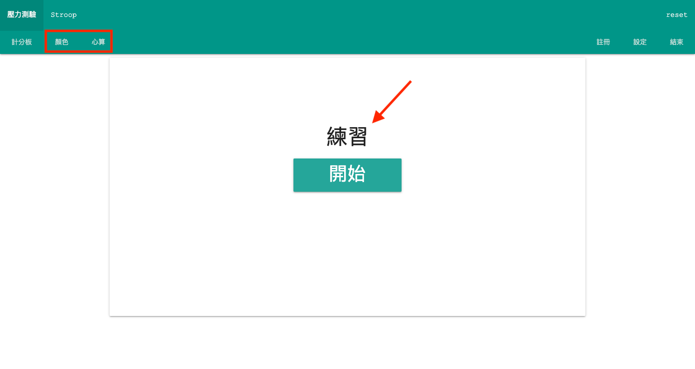

# Online Demo

[https://kwchung.github.io/stress/](https://kwchung.github.io/stress/)

# Locally Useage

## Requirment

- Node.js >= 8.2.0
- npm >= 5.2.0

前往 [Node.js 官網](https://nodejs.org)，並安裝左邊的 LTS 版本 Node.js。

## Run Project

1. 先準備好 `rank.json` 檔，內容為空陣列：
   ```
   []
   ```
2. 開啟命令提示字元，輸入 `npx serve .`
3. 開啟 `http://localhost:5000`
4. 選擇 `./index.html` 執行

# User Guide


註冊前點選左上角的「顏色」、「心算」按鈕會進入練習模式。



點選右上角「註冊」後會自動進入測驗模式，全程會自動跑完測試程序。測驗期間僅需點選「開始」按鈕繼續測驗，**請勿點選其他按鈕！**


完成所有測試後再點選右上角「結束」按鈕會下載本次測驗所有受測者的成績。
