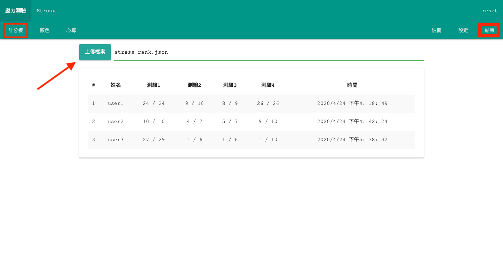
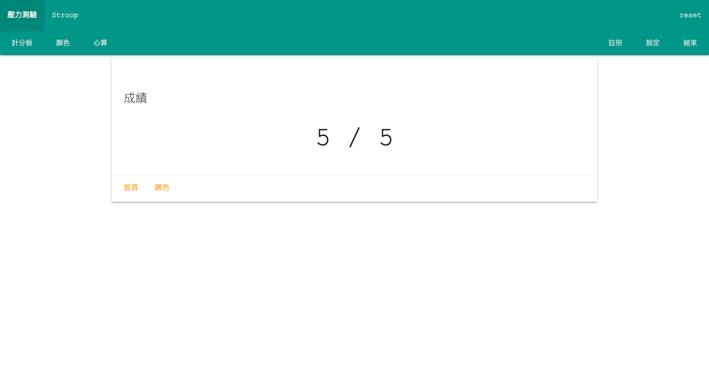
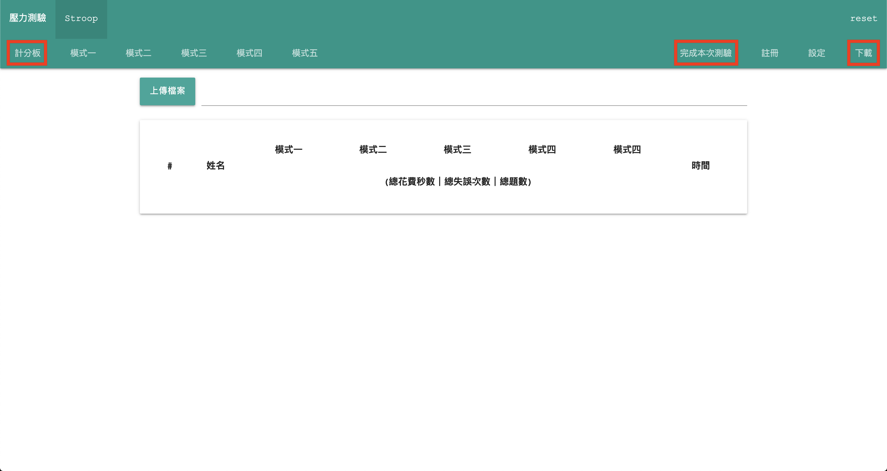
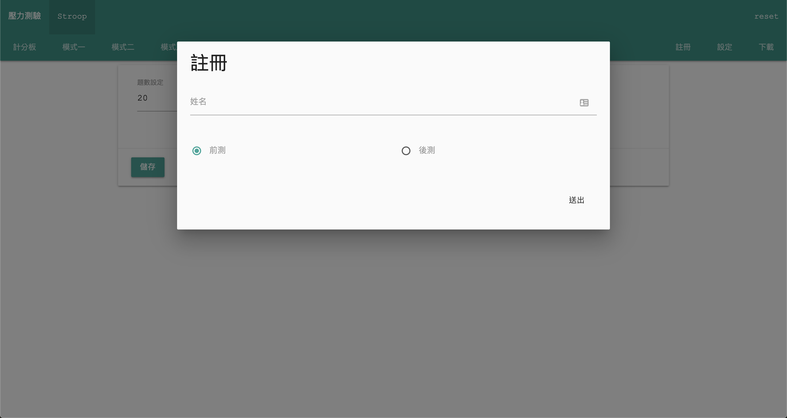
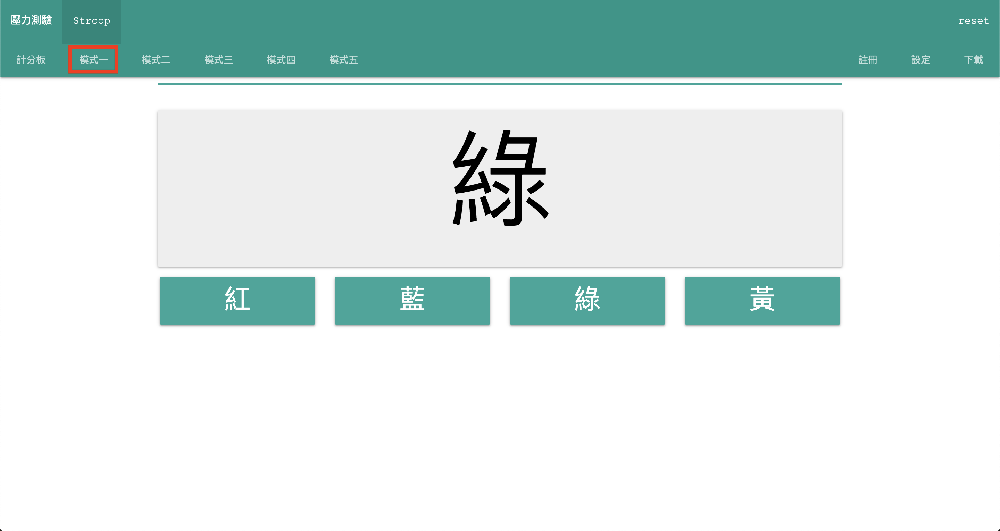
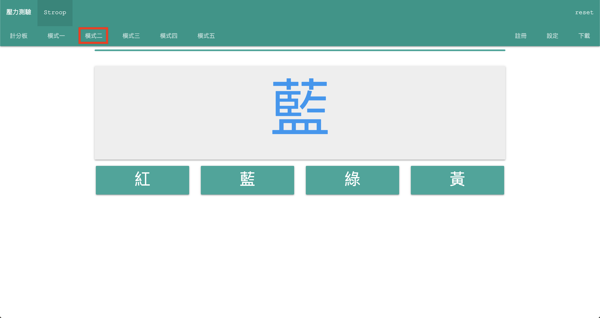
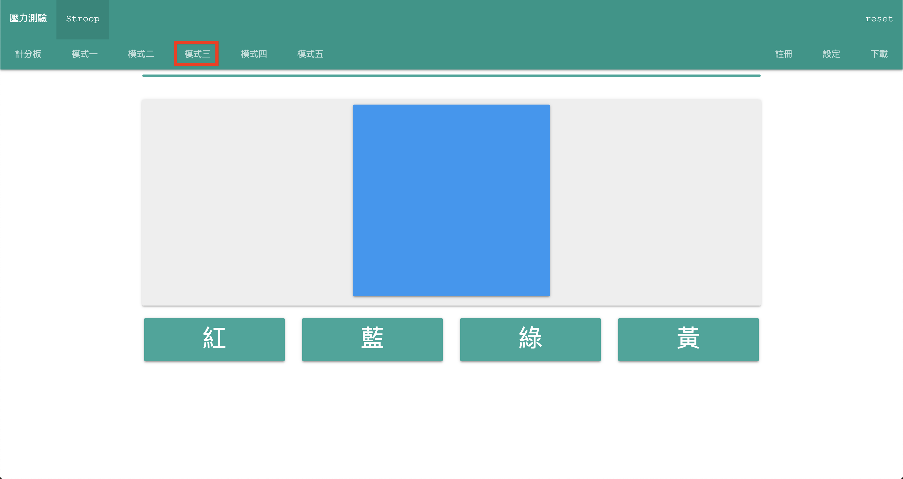
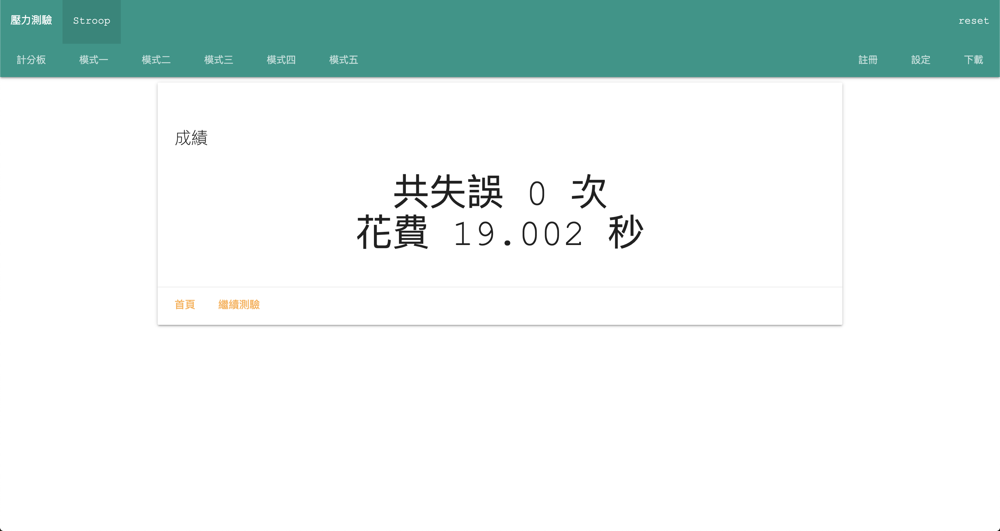
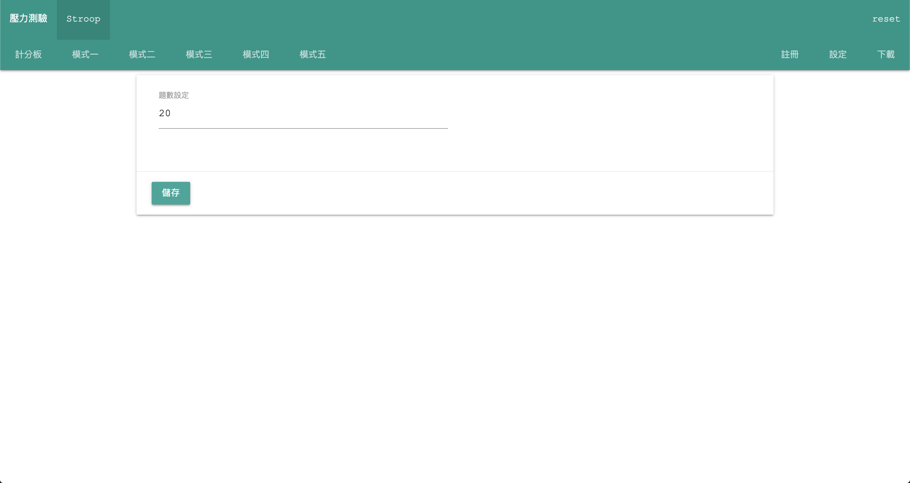

# Online Demo

[https://kwchung.github.io/stress/](https://kwchung.github.io/stress/)

# Locally Useage

## Requirement

- Node.js >= 8.2.0
- npm >= 5.2.0

前往 [Node.js 官網](https://nodejs.org)，並安裝左邊的 LTS 版本 Node.js。

## Run Project

1. 開啟命令提示字元，輸入 `npx serve .`
2. 開啟 `http://localhost:5000`

# User Guide

1. [壓力測驗](##壓力測驗)
2. [Stroop](##Stroop)

## 壓力測驗

在「計分板」頁面點選上傳檔案，讀取測驗成績。

註冊前點選左上角的「顏色」、「心算」按鈕會進入練習模式。

點選右上角「註冊」後會進入測驗模式。

進入測驗模式後，全程會自動跑完測試程序。測驗期間僅需點選「開始」按鈕繼續測驗，**測驗期間請勿點選其他按鈕！**

顏色測驗：選擇字的填色，如圖答案為「綠色」

心算測驗：計算畫面中數學題的答案

休息測驗

點選右上角「設定」，調整壓力測驗的時間參數

完成所有測試後再點選右上角「結束」按鈕會下載本次測驗所有受測者的成績。

## Stroop

在「計分板」頁面點選上傳檔案，讀取測驗成績。

點選右上角「註冊」後會進入測驗模式。

測驗模式一：選擇字的填色，如圖答案為「藍色」

測驗模式二：選擇字的填色，如圖答案為「綠色」

測驗模式三：選擇字的填色，如圖答案為「藍色」

點選右上角「設定」，調整stroop測驗的參數

完成所有測試後再點選右上角「結束」按鈕會下載本次測驗所有受測者的成績。